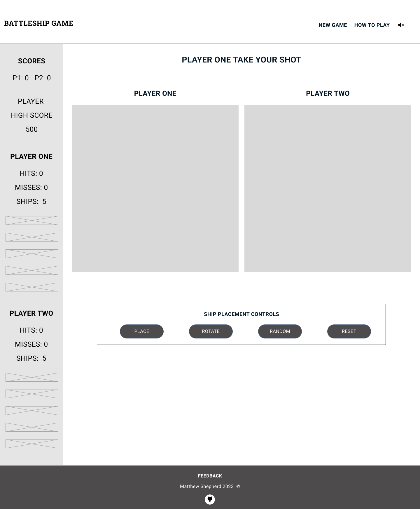
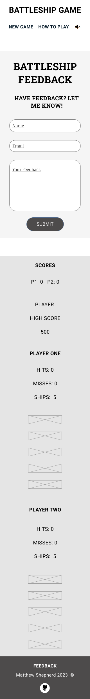
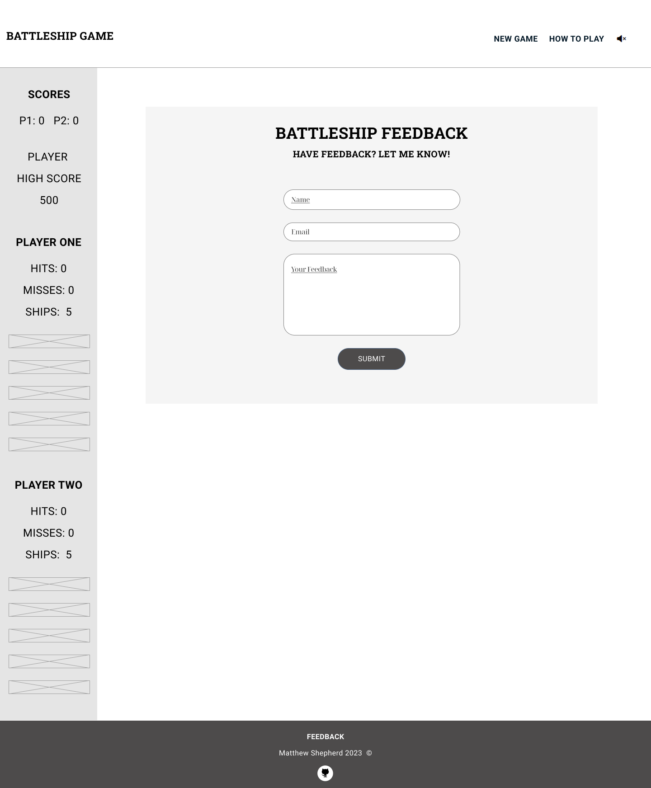
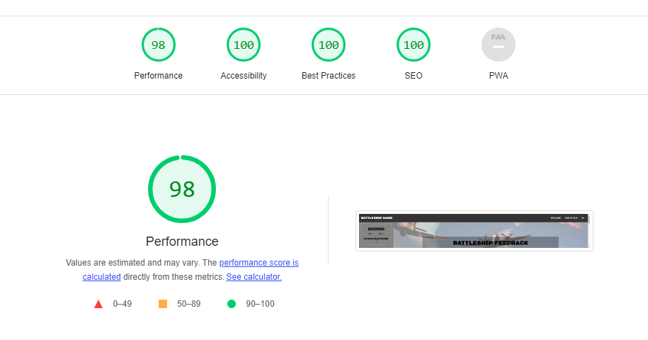

# BattleShip Game

(Developer: Matthew Shepherd)

[Live webpage](https://mat-shepherd.github.io/CI_PP2_BATTLESHIP_GAME/)

This project is a JavaScript-based Battleship game based on the classic baord game of Battleship. This is a responsive two-page game site which aims to provide casual online gamers with a simple, fun, and and interactive gaming experienc.

## Table of Contents

- [BattleShip Game](#battleship-game)
  - [Table of Contents](#table-of-contents)
  - [Project Goals](#project-goals)
    - [Site Owner Goals](#site-owner-goals)
    - [Site Owner Goals](#site-owner-goals-1)
  - [User Experience](#user-experience)
    - [Target Audience](#target-audience)
    - [User Requirements and Expectations](#user-requirements-and-expectations)
    - [User Stories](#user-stories)
      - [Players](#players)
      - [Site Owner](#site-owner)
  - [Design](#design)
    - [Design Choices](#design-choices)
    - [Colours](#colours)
      - [USER INTERFACE](#user-interface)
      - [PLAYER MESSAGES](#player-messages)
    - [Fonts](#fonts)
    - [Structure](#structure)
      - [INDEX PAGE, FEEDBACK PAGE, 404 PAGE](#index-page-feedback-page-404-page)
      - [FEEDBACK PAGE](#feedback-page)
      - [404 PAGE](#404-page)
    - [Wireframes](#wireframes)
    - [Index](#index)
    - [Feedback](#feedback)
    - [404](#404)
  - [Technologies Used](#technologies-used)
    - [Languages](#languages)
    - [Frameworks \& Tools](#frameworks--tools)
  - [Features](#features)
    - [Existing Features](#existing-features)
      - [Navigation Bar](#navigation-bar)
      - [New Game Link and Button](#new-game-link-and-button)
      - [How To Play Modal](#how-to-play-modal)
      - [Audio Toggle to Mute and Unmute Sounds](#audio-toggle-to-mute-and-unmute-sounds)
      - [Start Game Form](#start-game-form)
      - [Gameboard](#gameboard)
      - [Ship Placement Controls Area](#ship-placement-controls-area)
      - [Place Ships Button](#place-ships-button)
      - [Rotate Ships Button](#rotate-ships-button)
      - [Random Ship Placement Button](#random-ship-placement-button)
      - [Clear All Ships Button](#clear-all-ships-button)
      - [Ship Placement Feedback](#ship-placement-feedback)
      - [Player Message Area](#player-message-area)
      - [Sidebar Scoreboard](#sidebar-scoreboard)
      - [Computer Opponent](#computer-opponent)
      - [Player / Computer Shot Feedback](#player--computer-shot-feedback)
      - [Ship Hit, Miss and Sunk Feedback](#ship-hit-miss-and-sunk-feedback)
      - [Win and Loss Notification](#win-and-loss-notification)
      - [Alternating Player Gameboard grids on Small Screens](#alternating-player-gameboard-grids-on-small-screens)
    - [Footer](#footer)
      - [Feedback Form](#feedback-form)
      - [404 Page](#404-page-1)
    - [Features Left to Implement](#features-left-to-implement)
  - [Testing](#testing)
    - [HTML Validation](#html-validation)
    - [CSS Validation](#css-validation)
    - [JavaScript Validation](#javascript-validation)
    - [Accessibility](#accessibility)
    - [Performance](#performance)
    - [Index](#index-1)
    - [Feedback Page](#feedback-page-1)
    - [404](#404-1)
    - [Device testing](#device-testing)
    - [Browser compatibility](#browser-compatibility)
    - [Testing user stories](#testing-user-stories)
      - [Players](#players-1)
      - [PlayeSite Owner](#playesite-owner)
  - [Bugs](#bugs)
  - [Deployment](#deployment)
  - [Credits](#credits)
    - [Media](#media)
    - [Wireframes](#wireframes-1)
    - [Index Page, Feedback Page \& 404 Page](#index-page-feedback-page--404-page)
    - [Images](#images)
    - [Sounds](#sounds)
    - [Code](#code)
      - [Readme.md](#readmemd)
      - [index.html \& style.css](#indexhtml--stylecss)
      - [battleship-game.js](#battleship-gamejs)
      - [feedback-form.js](#feedback-formjs)
  - [Acknowledgements](#acknowledgements)

## Project Goals

The goals of this website include:

### Site Owner Goals

- Create a fun interactive game that furthers my understanding of problem solving through code and the JavaScript language
- Create an attractive and easy to use website and user interface
- Create a fully responsive game website

### Site Owner Goals

- Play a fun and interactive online game of logic and luck against a virtual opponent
- Quickly understand the rules of the game and how to play
- Be able to keep track of the game score and to try to beat their previous high score
- Play the game as often as desired and have the game remember their name and details

[Back to Table of Contents](#table-of-contents)

## User Experience

### Target Audience

- Battleship is typically played by anyone age 7 and up, that can follow the rules of Battleship, that likes to play online games, and has a JavaScript enabled web browser on their device.

### User Requirements and Expectations

- An intuitive navigation system regardless of screen size
- Easy to locate and understand game rules and instructions on how to play the game
- An intuitive game interface with clear controls and notifications to aid game play
- The ability to turn game sound effects on or off
- An easy way to provide the developer with feedback on the game
- An easy mechanism to start a new game and maintain session scores
- An accessibile game website that can be viewed and played on any device

### User Stories

The players of the game are the primary users of this website with site owner being a secondary user:

#### Players

1. As a player, I want to play an accessible, easy to understand, fun, and visually attractive game that is responsive on any device.
2. As a player, I want to see a list of game rules and instructions so I can understand how to play the game
3. As a player, I want to enter my name so I can understand which player represents me on the gameboard and to keep track of my current score and high score
4. As a player, I want my name to be validated and to be provided with feedback on any errors with name entry to ensure I can understand which player I am in the game.
5. As a player, I want to start a new game and receive directions on how to setup the gameboard
6. As a player, while setting up the gameboard, I want the ability to place and rotate my game pieces vertically or horizontally within the limits of the gameboard grid
7. As a player, I want any controls or buttons to be colourful, apparent, and attractive.
8. As a player, while setting up the gameboard, I want the ability to reset the gameboard to remove the game pieces (ships) and start placement over again
9. As a player, once the game board is set up, I want to play against a computer opponent
10. As a player, once the gameboard is set, up I want to be presented with notifications, visual, and audio cues to understand the game has started and which player's turn it is to take a shot
11. As a player, I want to be presented with notifications, visual, and audio cues to understand how to take a shot, where my shot is going to be placed, and confirmation that my shot was registered
12. As a player, once a turn has been taken, I want to be presented with notifications, visual, and audio cues to understand whose turn was taken and if the turn resulted in hitting or missing a ship
13. As a player, I want to be presented with notifications, visual, and audio cues at all times during the game to keep track of how many hits, how many misses, and how many ships remain for each player
14. As a player, I want to be presented with notifications, visual, and audio cues indicating when all of a player's ships have been sunk and which player has won the game
15. As a player, when a game has ended, I want to be given the option to start a new game
16. As a player, when a game has ended, I want my high score to be retained until I end my browser session
17. As a player, I want to be able to mute or unmute all game sounds

#### Site Owner

18. As the site owner, I want to receive feedback from players so I can understand if they are enjoying the game, identify any bugs, and continually improve the game.
19. As the site owner, I want users to see a 404 page if they enter an incorrect URL so they can be navigated back to the main game page.

[Back to Table of Contents](#table-of-contents)

## Design

### Design Choices

The aim of this site is to provide the look and feel of the classic Battleship board game with its naval theme, while also conveying a Retro arcade game feel. All images, colours, and sounds were chosen with this aim in mind.

### Colours

The colour scheme for the game was based around classic Battleship and Naval themed colours mixed with a Retro arcade feel:

#### USER INTERFACE

Primary Colours - Grey / Light Grey

Secondary Colours - Red / Green / Blue

 

#### PLAYER MESSAGES

The player message text used a supplementary colour scheme of green on black to compliment the Retro Arcade theme.
 

To remain WCAG AAA compliant, I chose dark colour variants for background colours behind white, black, or bright green text to maintain maximum contrast. Colour contrast compliance was tested using [WebAIM's Contrast Checker tool](https://webaim.org/resources/contrastchecker/).

### Fonts

Black Ops One, Press Start 2P, and Roboto fonts were selected from Google fonts to match the naval and arcade themes of the game while maintaining readability and accessibility.

Black Ops One font is used for the site logo and primary headings. Roboto font used is as the main body text including the navigation, sidebar score text, and footer.

Black Ops One fallback fonts are Lucida Sans Typewriter, Helvetica, and sans-serif.

The Roboto and Press Start 2P fallback fonts are Arial, Helvetica, and sans-serif.

Fonts are imported using the Google Fonts library.

### Structure

The pages are structured in an easy-to-navigate z-shaped pattern allowing visitors to quickly consume key information while scanning the page from left to right. Starting at the top left of the page the visitor will notice the game logo followed by the navigation menu including New Game and How to Play links and an audio toggle icon. This allows the user to quickly understand the name of the game, how to start a new game, how to play, and how to toggle audio on or off.

For simplicity, the site consists of one primary page and two helper pages, a feedback page and a 404 page. There are seven distinct sections used across the site's pages:

#### INDEX PAGE, FEEDBACK PAGE, 404 PAGE

- A header navigation bar containing the game logo followed by the navigation menu including New Game and How to Play links, and an audio toggle icon
  
- A score sidebar (which moves to the footer area on smaller screens) which contains the scores and schips remaining for both players.

- A start game screen, that covers the main game body area, and contains a form to collect the player's name, a start game button and an audio toggle button.
  
- The main game body area which contains the player message container, the player and computer gameboard grids, and the ship placmement controls (which are hidden once the player has placed thier ships)

- A How to Play modal which conveys the rules of the game and how to play
  
- A win game screen, which is shown when all ships have been sunk, communicating whether the player has won or lost and providing an option to start a new game

- A footer section which displays the business logo, business tagline, navigation menu, call to action button, navigation links, contact information, social media links, the site owner's name and copyright notice, and a link to the site owner's GitHub page.

#### FEEDBACK PAGE

- A feedback screen, that covers the main game body area, and contains a form to collect player feedback, validate form values, show a thank you message on submission, and email the form data to the site owner.

#### 404 PAGE

- A 404 page not found message screen, that covers the main game body area, to let the user know they have entered an incorrect URL and provide them with a New Game button to navigate back to the game index page.

### Wireframes

### Index

iPhone SE

iPad Mini

Desktop

### Feedback

iPhone SE

iPad Mini

Desktop

</detais>

### 404

iPhone SE

iPad Mini

Desktop

[Back to Table of Contents](#table-of-contents)

## Technologies Used

### Languages

- HTML
- CSS
- JavaScript

### Frameworks & Tools

- [Git](https://git-scm.com/)
- [GitHub](https://github.com/)
- [Windows Visual Studio Code](https://www.gitpod.io/)
- [CodeAnywhere - Cloud IDE](https://codeanywhere.com/)
- [GIMP - image editor](https://www.gimp.org/)
- [Figma - wireframing tool](https://www.figma.com/files/recent?fuid=1219987136949485526)
- [Google Fonts](https://fonts.google.com/)
- [Font Awesome](https://fontawesome.com/)
- [ChatGPT by OpenAI - for code validation formatting, & suggestions](https://chat.openai.com/)
- [EZGIF.COM - Create GIFs from Image Frames](https://ezgif.com/maker)
- [Favicon.io - Favicon generator](https://favicon.io/)
- [Coolors.co - Colour Palette Display Tool](https://coolors.co/)
- [Unscreen - Image Background Removal](https://www.unscreen.com/)
- [Cloudconvert - Convert Audio Files to MP3](https://cloudconvert.com/)
- [Audacity - Audio Editing Tool](https://www.audacityteam.org)
- [JSHint JavaScript Validation Tool](https://jshint.com/)
- [W3C Markup Validation Service](https://validator.w3.org/)
- [W3C CSS Validation Service](https://jigsaw.w3.org/css-validator/)
- [WAVE web accessibility evaluation tool](https://wave.webaim.org/)
- [Google Lighthouse](https://developer.chrome.com/docs/lighthouse/overview/)

[Back to Table of Contents](#table-of-contents)

## Features

The website consists of three pages in total, an index page, a feedback page, and a 404 page. The site's pages contain ... distinct features:

### Existing Features

#### Navigation Bar

- Display a navigation bar with links to start a new game, see details on how play, and audio toggle icon which indicates whether audio is on or off.
- User stories covered: 1, 2, 5, 7, 8, 15, 17
  

#### New Game Link and Button

- A link in the navigation bar and buttons presented in win game modal, feedback form, and 404 page, that loads the index.html page clearing all game objects. 
- If the player has entered their name already, the player's name, score, and high score values are passed via parameter to index.html to be preserved in the new game. 
- If a player name has already been entered, the player skips the start game form and is prompted to place their ships.
- If no player name has been entered, the start game form is presented so the user can enter their name and start a new game.
- User stories covered: 1, 3, 7, 8, 15, 16 17

#### How To Play Modal

- When clicked, the How to Play link in the navigation bar displays a modal that provides game rules, instructions on how to play, and details of available controls.
- User stories covered: 1, 2, 5

#### Audio Toggle to Mute and Unmute Sounds

- All game sounds are muted by default
- An audio toggle icon is present in the navigation bar that allows game sounds to be completely unmuted or muted. When clicked the icon marker changes to indicate if game sounds are currently mure or unmuted.
- An audio toggle button is presented in the start game form to allow the player to unmute or mute game sounds. When toggled the button changes colour and tells the player that audio is off or audio is on.
- User stories covered: 1, 7, 17

#### Start Game Form

- When the index page loads, a form is presented the player so they can enter their name and start a new game.
- The name entered is validated as it can only be up to charcters long and a name must be entered before the form can be submitted
- The player name provided is used in the score sidebar, above the player's gameboard grid, in player messages, and in the win lose game modal, to let them know which scores and gameboard grid belongs to them, and which messages relate to their turn.
- The form also contain a button to toggle audio on or off. Audio is muted by default.
- User stories covered: 1, 3, 5, 10, 11, 12, 13, 14, 15, 16, 17

#### Gameboard

- The gameboard, which is the main gameplay area in the center of the screen, where players place their ships by clicking on their grid and by using placememnt controls, and take shots by clicking on the computer grid, and receive notifications via the player message area, as visual well as visual and audio cues, and eventually then lose game modal.
- User stories covered: 1, 6, 7, 8, 9, 10, 11, 12, 13, 14, 15, 16

#### Ship Placement Controls Area

- Provides buttons to allow players to place, rotate, randomly place, or clear their ships on their gameboard grid.
- This area is hiddeen once turn based gameplay begins
- User stories covered: 1, 5, 6, 7, 8

#### Place Ships Button

- Receive validation and feedback during ship placement to ensure it is within the limits of the gameboard grid.
- User stories covered: 1, 6, 7, 8

  
#### Rotate Ships Button

- Rotate ships to change their orientation on the gameboard grid.
- User stories covered: 1, 6, 7

#### Random Ship Placement Button

- Randomly places player ships on the player's gameboard grid and starts turn based gameplay.
- Game buttons have a pulse animation to highlight when the user needs to use these controls.
- User stories covered: 1, 6, 7
  

#### Clear All Ships Button

- Clears all of the player's manual ship placements during the ship placement stage of the game.
- User stories covered: 1, 7, 8

#### Ship Placement Feedback
- During this ship placement phase of the game, the player is provided with visual cues and feedback on which grid cells they can place ships on.
- Once a player clicks on their grid to place the ship the placement control buttons display a pulse effect to let the user know clicking one of these buttons is the next required action.
- Player messages are updated to let the player know which placement options are availalbe and how to proceed.
- A 4 headed arrow placement icon and white cell background colour is shown on hover over the player's available grid spaces, but not shown out of grid bounds.
- A stop symbol / no placement icon is shown over the computer's grid where the player can not place ships.
- Once a ship is placed the player is shown a stop symbol / no placement icon in the cells the ship occupies to tell them they can't place a ship.
- If a player tries to place a ship by pressing the place button while the ship overlaps an existing ship or extends outside the bounds of their grid a a red bakkground is shown in the relevant cell and a red ehip placement error is shown in the player message area.
- User stories covered: 1, 2, 5, 5, 7, 8

#### Player Message Area

- Receive messages and notifications to provide important information during the game. Including notifications of how to play the game, how to place ships, which players turn it is, what action needs to be taken next to continue gameplay, the coordinates a shot was taken at, and whether a shot results in a ship being hit, missed, or sunk.
- User stories covered: 1, 2, 3, 5, 10, 11, 12, 13, 14

#### Sidebar Scoreboard

- Show a scoreboard in the sidebar that keeps track of the player's high score, and each player's score, hits, misses, and ships remaining.
- When the user starts a new ame their name, score and high score is preserved in the sidebar
- User stories covered: 1, 3, 9, 1, 12, 13, 14, 15, 16

#### Computer Opponent

- The player plays against a computer opponent that randomly place's hidden ships on the computer's gameboard grid for the player to take shots on.
- Computer ships become visibile to the player once sunk.
- The computer takes random shots on the player's gameboard grid.
- User stories covered: 1, 9

#### Player / Computer Shot Feedback
- During the turn-based shot gameplay, the player is provided with visual cues and feedback on which grid cells they can take a shot on.
- Player messages are updated to let the player know which player is taking a shot and how to proceed.
- A red target / crosshair shooting icon and white cell background colour is shown on hover over the computer's grid spaces that are available to take a shot on. The icon is not shown out of grid bounds.
- If a player hits or misses a ship icons are added to the relevant cells to let the player know the result of the shot.
- Once a player has shot on a cell a stop symbol / no placement icon is shown when hovering over cells which have already been shot on and are no longer available for shooting on.
- User stories covered: 1, 2, 5, 5, 7, 10, 11, 12, 13, 14

#### Ship Hit, Miss and Sunk Feedback

- When ships are hit, missed, or sunk the player is notified via visual markers, sounds, scorebaord updates, and notifications in the player message area.
- A ship hit results in an explosion animation at the hit location on the gameboard grid, followed by a fire marker at the location, an explosion sound, a notification of the hit location in the player message area, and an update to the relevant player's hit score in the sidebar.
- A ship miss results in an splash animation at the hit location on the gameboard grid, followed by a splash marker at the location, a splash sound, a notification of the miss location in the player message area, and an update to the relevant player's miss score in the sidebar.
- A ship being hit across all of its grid locations means the ship is sunk. Sinking a ship results in a explosion and sinking sound, a notification of the ship that was sunk in the player message area, an update to the relevant player's Ship count in the sidebar, and a red X icon being placed over the relevant player's sunk ship.
- If a computer's hip is sunk the ship which was previously not visibile is made visible.
- User stories covered: 1, 10, 11, 12, 13, 14

#### Win and Loss Notification

- When a the player or computer's ships are all sunk a win game modal is show and a sound played to let the player know if they ahve won or lost.
- The player's score and high score are presented.
- A New Game button is presented to allow the player to start a new game while maintining their name and score values.
- User stories covered: 1, 13, 14, 15, 16

#### Alternating Player Gameboard grids on Small Screens

- On small screens and mobile devices, the active gameboard grid is moved to the top of the gameboard column to allow the player to see and interact with the active gaeeboard grid without having to scroll.
- User stories covered: 1, 10, 12

### Footer

- Contains a link to the Feedback page and and the developer's GitHub page
- User stories covered: 18

#### Feedback Form

- A feedback page which includes a feedback form to collect a player's name, email address, and feedback message.
- The feedback form connects to the EmailJS service to validate the form fields and email the form data to the developer
- A thank you message is shown on the same page when the form has beens ubmitted a New Game button is rpesented to the player so they can navigate back to the game.
- User stories covered: 18

#### 404 Page

- Display a customized 404 page with a link to start a new game.
- User stories covered: 19

### Features Left to Implement

The following features could be implemented in the future to provide users with more detailed information and further build prospective client trust through the website:

- I purposefully didn't hyperlink the logo to the index page to avoid a user clicking on it and losing their game progress. A click listener could be added to the logo and function added to warn the user before abandoning a game in progress.
- A 'smarter' computer opponenent could be implemented which would take random shots within a close range of a previous hit shout if that shot didn't result in sinking a ship. Currently the computer takes completely random shots within the bounds of the game grid, avoiding coordiantes that ahve a lready been shot on.
- With the ability to make the computer opponent 'smarter', a game difficulty feature could be added to let the user choose how difficult they want the game to be.
- I added an attribute for direction to ship objects with the intention of adding a flying plane animation when shots are taken. Knowing if a ship is vertical or horizontal and it's coordinates would allow a plane image to be animated horizontally or vertically across the board to match the ships rotation. Otherwise the plane would randomlyfly horizontally or vertically across the board if the shot was a miss.

[Back to Table of Contents](#table-of-contents)

## Testing

### HTML Validation

The W3C Markup Validation Service was used to validate the HTML of the website. All pages pass with no errors and no warnings shown.

- index.html [results](https://validator.w3.org/nu/?doc=https%3A%2F%2Fmat-shepherd.github.io%2FCI_PP2_BATTLESHIP_GAME%2F)
- feedback.html [results](https://validator.w3.org/nu/?doc=https%3A%2F%2Fmat-shepherd.github.io%2FCI_PP2_BATTLESHIP_GAME%2Ffeedback.html)
- 404.html results [results](https://validator.w3.org/nu/?doc=https%3A%2F%2Fmat-shepherd.github.io%2FCI_PP2_BATTLESHIP_GAME%2F404.html)

### CSS Validation

The W3C Jigsaw CSS Validation Service was used to validate the CSS of the website.

- styles.css [results](https://jigsaw.w3.org/css-validator/validator?uri=https%3A%2F%2Fmat-shepherd.github.io%2FCI_PP2_BATTLESHIP_GAME%2Fassets%2Fcss%2Fstyle.css&profile=css3svg&usermedium=all&warning=1&vextwarning=&lang=en)

### JavaScript Validation

The JS Hint JavaScript Validation Service was used to validate the JavaScript code on the website. The results below show three code warnings related to "Functions declared within loops referencing an outer scoped variable may lead to confusing semantics". This was related to code I used to store and retrie click handlers and proved to be a difficult issue to overcome. I'm flaggining hhis for future improvement:

**Metrics**
There are 66 functions in this file.
Function with the largest signature take 8 arguments, while the median is 1.
Largest function has 53 statements in it, while the median is 6.
The most complex function has a cyclomatic complexity value of 25 while the median is 2.

**Three warnings**

- 1032	Functions declared within loops referencing an outer scoped variable may lead to confusing semantics. (currentShip, players, playerShips, computerShips, gameBoards, currentPlayer)
- 1071	Functions declared within loops referencing an outer scoped variable may lead to confusing semantics. (players, playerShips, computerShips, gameBoards, currentPlayer, currentShip)
- 1567	Functions declared within loops referencing an outer scoped variable may lead to confusing semantics. (currentShip, players, playerShips, computerShips, gameBoards, currentPlayer, randomShip, clearShips)

### Accessibility

The WAVE WebAIM web accessibility evaluation tool was used to ensure the website met high accessibility standards. All pages pass with 0 errors.

- index.html [results](https://wave.webaim.org/report#/https://mat-shepherd.github.io/CI_PP2_BATTLESHIP_GAME/index.html)
- feedback.html [results](https://wave.webaim.org/report#/https://mat-shepherd.github.io/CI_PP2_BATTLESHIP_GAME/feedback.html)
- 404.html results [results](https://wave.webaim.org/report#/https://mat-shepherd.github.io/CI_PP2_BATTLESHIP_GAME/404.html)

### Performance

Google Lighthouse in Google's Chrome Developer Tools was used to test the performance of the website. All elements performed well with peformance scores above 90, accessiblity and SEO scores of 100, and best rpactice scores in the 90 to 100 range. The 404 page had a 92 best practice score for some lower clarity images but these are ship and fire icons which are samll by design.

### Index

Mobile

Desktop

### Feedback Page

Mobile

Desktop

### 404

Mobile

Desktop

### Device testing

The website was tested on the following devices:

- Windows 10 Pro Desktop PC
- Windows 10 Pro Microsoft Surface Book 2
- Samsung Galaxy S10

In addition, the website was tested using Google Chrome Developer Tools simulating all available device options.

### Browser compatibility

The website was tested on the following browsers:

- Google Chrome Version 112.0.5615.138 (Official Build) (64-bit)
- Mozilla Firefox Version 112.0.1 (64-bit)
- Microsoft Edge Version 112.0.1722.48

### Testing user stories

#### Players

1. As a player, I want to play an accessible, easy to understand, fun, and visually attractive game that is responsive on any device.

| **Feature** | **Action** | **Expected Result** | **Actual Result** |
|-------------|------------|---------------------|-------------------|
| Start game screen | Player navigates around links and controls on screen  | Player finds game instructions and understand how to start a game by entering their name | Works as expected |
| Gameplay screen| Player enters thier name and enters gamplay screen and navigates the gameboard grids and controls | Player understands how to continue gameplay | Works as expected |

Video

 

2. As a player, I want to see a list of game rules and instructions so I can understand how to play the game

| **Feature** | **Action** | **Expected Result** | **Actual Result** |
|-------------|------------|---------------------|-------------------|
| Navigation Bar How to Play Link  | Click How To Play link in the navigation bar  | Works as expected |
| How To Play Modal | Click How To Play link in the navigation bar             | How to play modal is displayed and user can scroll through rules and instructions on how to play the game | Works as expected |
| Navigation Bar How to Play Link  | Click How To Play link in the navigation bar  | Works as expected |

Video

 

3. As a player, I want to enter my name so I can understand which player represents me on the gameboard and to keep track of my current score and high score
| **Feature** | **Action** | **Expected Result** | **Actual Result** |
|-------------|------------|---------------------|-------------------|
|   |   |   | Works as expected |
|   |   |   | Works as expected |

Video

 

4. As a player, I want my name to be validated and to be provided with feedback on any errors with name entry to ensure I can understand which player I am in the game
| **Feature** | **Action** | **Expected Result** | **Actual Result** |
|-------------|------------|---------------------|-------------------|
|   |   |   | Works as expected |
|   |   |   | Works as expected |

Video

 

5. As a player, I want to start a new game and receive directions on how to setup the gameboard
| **Feature** | **Action** | **Expected Result** | **Actual Result** |
|-------------|------------|---------------------|-------------------|
|   |   |   | Works as expected |
|   |   |   | Works as expected |

Video

 

6. As a player, while setting up the gameboard, I want the ability to place and rotate my game pieces vertically or horizontally within the limits of the gameboard grid
| **Feature** | **Action** | **Expected Result** | **Actual Result** |
|-------------|------------|---------------------|-------------------|
|   |   |   | Works as expected |
|   |   |   | Works as expected |

Video

 

7. As a player, I want any controls or buttons to be colourful, apparent, and attractive
| **Feature** | **Action** | **Expected Result** | **Actual Result** |
|-------------|------------|---------------------|-------------------|
|   |   |   | Works as expected |
|   |   |   | Works as expected |

Video

 

8. As a player, while setting up the gameboard, I want the ability to reset the gameboard to remove the game pieces (ships) and start placement over again
| **Feature** | **Action** | **Expected Result** | **Actual Result** |
|-------------|------------|---------------------|-------------------|
|   |   |   | Works as expected |
|   |   |   | Works as expected |

Video

 

9.  As a player, once the game board is set up, I want to play against a computer opponent
| **Feature** | **Action** | **Expected Result** | **Actual Result** |
|-------------|------------|---------------------|-------------------|
|   |   |   | Works as expected |
|   |   |   | Works as expected |

Video

 

10. As a player, once the gameboard is set, up I want to be presented with notifications, visual, and audio cues to understand the game has started and which player's turn it is to take a shot
| **Feature** | **Action** | **Expected Result** | **Actual Result** |
|-------------|------------|---------------------|-------------------|
|   |   |   | Works as expected |
|   |   |   | Works as expected |

Video

 

11. As a player, I want to be presented with notifications, visual, and audio cues to understand how to take a shot, where my shot is going to be placed, and confirmation that my shot was registered
| **Feature** | **Action** | **Expected Result** | **Actual Result** |
|-------------|------------|---------------------|-------------------|
|   |   |   | Works as expected |
|   |   |   | Works as expected |

Video

 

12. As a player, once a turn has been taken, I want to be presented with notifications, visual, and audio cues to understand whose turn was taken and if the turn resulted in hitting or missing a ship
| **Feature** | **Action** | **Expected Result** | **Actual Result** |
|-------------|------------|---------------------|-------------------|
|   |   |   | Works as expected |
|   |   |   | Works as expected |

Video

 

13.  As a player, I want to be presented with notifications, visual, and audio cues at all times during the game to keep track of how many hits, how many misses, and how many ships remain for each player
| **Feature** | **Action** | **Expected Result** | **Actual Result** |
|-------------|------------|---------------------|-------------------|
|   |   |   | Works as expected |
|   |   |   | Works as expected |

Video

 

14.  As a player, I want to be presented with notifications, visual, and audio cues indicating when all of a player's ships have been sunk and which player has won the game
| **Feature** | **Action** | **Expected Result** | **Actual Result** |
|-------------|------------|---------------------|-------------------|
|   |   |   | Works as expected |
|   |   |   | Works as expected |

Video

 

15. As a player, when a game has ended, I want to be given the option to start a new game
| **Feature** | **Action** | **Expected Result** | **Actual Result** |
|-------------|------------|---------------------|-------------------|
|   |   |   | Works as expected |
|   |   |   | Works as expected |

Video

 

16. As a player, when a game has ended, I want my high score to be retained until I end my browser session
| **Feature** | **Action** | **Expected Result** | **Actual Result** |
|-------------|------------|---------------------|-------------------|
|   |   |   | Works as expected |
|   |   |   | Works as expected |

Video

 

17. As a player, I want to be able to mute or unmute all game sounds
| **Feature** | **Action** | **Expected Result** | **Actual Result** |
|-------------|------------|---------------------|-------------------|
|   |   |   | Works as expected |
|   |   |   | Works as expected |

Video

 

#### PlayeSite Owner

18. As the site owner, I want to receive feedback from players so I can understand if they are enjoying the game, identify any bugs, and continually improve the game
| **Feature** | **Action** | **Expected Result** | **Actual Result** |
|-------------|------------|---------------------|-------------------|
|   |   |   | Works as expected |
|   |   |   | Works as expected |

Video

 

19. As the site owner, I want users to see a 404 page if they enter an incorrect URL so they can be navigated back to the main game page
| **Feature** | **Action** | **Expected Result** | **Actual Result** |
|-------------|------------|---------------------|-------------------|
|   |   |   | Works as expected |
|   |   |   | Works as expected |

Video

 

[Back to Table of Contents](#table-of-contents)

## Bugs

| **Bug** | **Fix** |
| ----------- | ----------- |
| Gameboard layout on mobile devices | Due to the square nature and required size of the grids to be able to interact with indivudal cells, responsive layout was tricky and led to horizontal overflow on small screens, poor spacing of elements on mobile devices, and a poor responsive user experience. To correct this I set the gameboard area to column layout below 1600px breakpoint and reduced the size of the ships grids cells to half the size of those on desktop. I then set the ship and icon images to a % based width to make them respond to the gaemboard grid cell size. |
| Scrolling on mobile devices | Due to column layout on small screens the player would have to scroll and up and down the screen when taking turns to understand what the computer player did during their turn and to take their shot. As Player message pulls focus to the top of the screen when it updates this was creating a very poor user experience. To crrect this I added a gameboard-reverse class to the gaemboard div in the checkTurn function. Adding this class changes the order of the flex positioned gameboard grids, which allows the active grid to always show at the top of the gameboard. This also keeps the player viewing the top of the viewport and minimises jumping back to the top of the screen when the player message updates. |
|  Rotating grid cells would rotate hit and miss icons | The functions which rotate ship images on the gameboard actually rotate the containing div by multipls of 90 degrees to ensure the image pivots around the center of the cell the ship was placed in. This worked well but created an issue where ship hit or miss icons when added to the original ship placement cell were also rotated, which looked odd and inconsistent with icons show elsewhere on the board. To fix this I introduced a check into functions which add ship hit or miss icons to see if the parent div class contained transform. If it did the icon image would then be rotated -90 degrees. |
|  Player message timing |  As the game progresses through each player's turn it proveed tricky to slow down gameplay and ensure that player messages were visible long enough to read before they were replaced by the next player message. While this is not fully resolved to my liking I introduced setTimeoutet functions aroun player messages to add delays before they are shown to give the previous message time to display. When ships are sunk it provde very difficult to give the message time to display. With help from an approach provided by ChatGPT I introduced a delay function and a promise object to delay gameplay to give this ship sunk message time to display before gamplay resumes. |
| Deleting grid click listeners | Each player grid allows the user to inidcate the cells they will place ships in or take shots on by adding click listeners when grids are created and disabling click listeners when it is the computer's turn or a grid location is occupied by a ship or a shot. Removing click listeners was a difficult issue to solve as each cell's click listener was specific to it and a reference to the specific listenenr had to be stored somewhere for later retrieval to remove the correct listener for the correct grid and cell. With guodance from ChatGPT I decided to store the place and shoot event listeners in attributes of the Gameboard object so I could loop through the relevant gameboard's placeEventHandlers or shootEventHandlers to find the click listener for relevant grid cell. This worked well but I still had an issue where I need to disable all grid listeners on the opposing player's grids to ensure the player couldn't randomly trigger unexpected functions. The quick fix for this was found in an article by Coding Deft, which led to the addition of a style to gameboard grid elements that set pointer-events: none on the on-active gameboard grid during checkTurn. |
| Poor page load on mobile devices  | On testing the game index page with Lighthouse I was receving a perfomance score in the 70s, largely due to the loading and rendering of the repeating ocean tile gif in the background of the gameboard. I exploed multiple options including replacing this with a video of the effect but in the end settled on using a lazy loading approach. A lazyLoadBackground function was provided by chatGPT and dapted to make the ocean tile background load only when initPlacement was called to start rendering the gameboards. This greatly improved page load performance on mobiles with scores in the 90s.|

[Back to Table of Contents](#table-of-contents)

## Deployment

The website was deployed using GitHub Pages by following these steps:

1. In the GitHub repository navigate to the Settings tab
2. On the left-hand menu select Pages
3. For the source select Branch: master
4. After the webpage refreshes automatically you will see a ribbon on the top saying: Your site is live at <https://mat-shepherd.github.io/CI_PP2_BATTLESHIP_GAME/>

You can for fork the repository by following these steps:

1. Go to the GitHub repository
2. Click on Fork button in the upper right-hand corner

You can clone the repository by following these steps:

1. Go to the GitHub repository
2. Locate the Code button above the list of files and click it
3. Select if you prefer to clone using HTTPS, SSH, or Github CLI and click the copy button to copy the URL to your clipboard
4. Open Git Bash
5. Change the current working directory to the one where you want the cloned directory
6. Type git clone and paste the URL from the clipboard ($ git clone <https://github.com/YOUR-USERNAME/YOUR-REPOSITORY>)
7. Press Enter to create your local clone.

[Back to Table of Contents](#table-of-contents)

## Credits

Images not referenced below are owned or created by the developer.

### Media

In order of appearance:

### Wireframes

- [Figma Wireframing Kit](https://www.figma.com/community/file/1088059168988686975) by [Tiago Gonçalves](https://www.figma.com/community/file/1088059168988686975)
- [Website Wireframes UI Kit](https://www.figma.com/community/file/1212997233512196965) by [UI-UX Expert](https://www.figma.com/@uiux_expert)
- Font Awesome Icons by [Font Awesome](https://fontawesome.com/)

### Index Page, Feedback Page & 404 Page

### Images
- Battleship Start Game Background Image - [Generated with DALL·E 2 byOpenAI](https://openai.com/dall-e-2)
- Battleship Game Piece Ship Icons - [Sea Warfare Set: Ships and More](https://opengameart.org/content/sea-warfare-set-ships-and-more) by ([Lowder2](https://opengameart.org/users/lowder2))
- Gameboard Background Ocean tile - [The Battle for Wesnoth: Water Animation](https://opengameart.org/content/the-battle-for-wesnoth-water-animation) by ([Zookeeper and Zabin](https://opengameart.org/users/zabin))
- Sidebar Background Metal Plate Tile - [Metal Tiles collection](https://opengameart.org/content/metal-tiles-collection) by [wovado](https://opengameart.org/users/wovado)
- Grid Explosion Animation - [WGStudio: Explosion Animation](https://opengameart.org/content/wgstudio-explosion-animation) by ([Retimer](https://opengameart.org/users/retimer))
- Grid Fire Animation - [9-frame Fire Animation](https://opengameart.org/content/9-frame-fire-animation-16x-32x-64x) by ([FoshyTakashi](https://opengameart.org/users/foshytakashi))
- Grid Splash Effect - [Splash Effect 32x32](https://opengameart.org/content/splash-effect-32x32) by ([Jesse McCarthy](https://opengameart.org/users/jesse-mccarthy))
- Grid Crosshair icon - [Crosshair icons](https://www.flaticon.com/free-icons/crosshair) created by ([Muhammad_Usman - Flaticon](https://www.flaticon.com/authors/muhammad-usman))
- Grid Move Icon - [Move icons](https://www.flaticon.com/free-icons/move) created by ([Freepik - Flaticon](https://www.flaticon.com/authors/freepik))
- Grid Not Allowed Icon - [Block icons](https://www.flaticon.com/free-icons/block) created by ([Freepik - Flaticon](https://www.flaticon.com/authors/freepik))
- Scoreboard Red X Icon - [Forbidden icons](https://www.flaticon.com/free-icons/forbidden) created by [Freepik - Flaticon](https://www.flaticon.com/)

### Sounds
- Game Start Intro Sound - [Sounds of Cannonballs in the Wall in the Morning](https://opengameart.org/content/sounds-of-cannonballs-in-the-wall-in-the-morning) by ([İlker Yalçıner](http://ilkeryalciner.com))
- Ship Placed Splash Sound - [Lava Splash](https://opengameart.org/content/lava-splash) by ([Michel Baradari](http://apollo-music.de/)) and ([Qubodup](https://opengameart.org/users/qubodup))
- Ship Hit Explosion Sound - [Tiny Naval Battle Sounds Set](https://opengameart.org/content/tiny-naval-battle-sounds-set) by Iwan Gabovitch (qubodup@gmail.com)
- Shot Miss Splash Sound - [Ocean Splash](https://opengameart.org/content/ocean-splash) by ([Thimras](https://opengameart.org/users/thimras))
- Ship Sunk Explosion Sinking Sound - [Ship Sinking](https://opengameart.org/content/ship-sinking) by ([Thimras](https://opengameart.org/users/thimras))
- Game Win Sound - [Victory 2](https://opengameart.org/content/victory-2) by ([Jon K. Fite](https://opengameart.org/users/jkfite01))
- Game Lose Sound - [Total Fail](https://opengameart.org/content/total-fail) by ([congusbongus](https://opengameart.org/users/congusbongus))
  
### Code

In order of appearance:

#### Readme.md
- The markdown structure of this readme and the deployment steps were based on the structure and content of the following readme.md files from other Code Institute student projects:
  - <https://github.com/4n4ru/CI_MS1_BodelschwingherHof>
  - <https://github.com/jamie2210/CI_MS1_TBC>
  - <https://github.com/aleksandracodes/CI_PP2_SunshineGuessing>

#### index.html & style.css
- Game Intro, Rules & Win Modals - Code adpated from [this 'How TO - CSS/JS Modal' article](https://www.w3schools.com/howto/howto_css_modals.asp) by W3Schools(https://www.w3schools.com/)
- CSS code to center the how to play modal adpated from [this Stackoverflow answer](https://stackoverflow.com/a/32086720/21643967) by [Bill Alexy](https://stackoverflow.com/users/2913352/bill-alexy)
- Placement Button Retro Styles adapted from [this Retro Buttons CodePen](https: //codepen.io/Brandon-Stoyles/pen/RajYmd) by[Brandon-Stoyles](https://codepen.io/Brandon-Stoyles)
- Placement Button Pulse Effect adapted from the code in [this 'CSS ANIMATION - THE PULSE EFFECT' article](https://www.florin-pop.com/blog/2019/03/css-pulse-effect/) by [Florin Pop](https://www.florin-pop.com/)
- Animation to make Player Message text flash on error. Code adapted from answer provided by [ChatGPT](https://chat.openai.com/) by [OpenAI](https://openai.com)

#### battleship-game.js
- The loop to add event listeners to buttons adapted from the [Code Institute's Love Maths Projects](https://github.com/Code-Institute-Org/love-maths)
- The method to disable click events on gameboard grids was learned from [this Codingdeft article](https://www.codingdeft.com/posts/disable-click-on-div-javascript-css/) by [by Abhishek EH](https://twitter.com/abhieh9)

- The placeShip function that populates all of a ship's coordinates by increasing row letter and column number based on the size of the ship was largely based on code adapted from answers provided by [ChatGPT by OpenAI](https://openai.com/).
- The audioToggle function to mute and unmute all audio elements on a page and have each audio element check mute status when created was largely based on code adapted from answers provided by [ChatGPT by OpenAI](https://openai.com/).
- The code in the rotateShip function that transforms a ships coordinates was pieced together and adapted from code provided by [ChatGPT by OpenAI](https://openai.com/).
- The method to rotate images was learned from [this 'How to Rotate an Image with JavaScript' article](https://codingbeauty.medium.com/javascript-rotate-image-ad2f05eafeb2) by[Coding Beauty](https://codingbeauty.medium.com/?source=post_page-----ad2f05eafeb2--------------------------------)
- The method to clone elements to remove events listeners was learned from [ChatGPT by OpenAI](https://openai.com/).
- The code in the confirmPlaceship function to get next ship in the playerShips object was largely copied from an answer by [ChatGPT by OpenAI](https://openai.com/).
- The code in sinkShip and the delay function that adds delay between the ship sunk message and the next player message from CheckTurn was copied from an answer Snippet provided by [ChatGPT by OpenAI](https://openai.com/).
- The method to store event handlers for later reference and a fix for an issue relating to "Functions declared within loops referencing an outer scoped variable may lead to confusing semantics" were adapted from answers by [ChatGPT by OpenAI](https://openai.com/).
- The code in the playerMessage function to make Player Message text flash on error was adapted from answers provided by [ChatGPT](https://chat.openai.com/) by [OpenAI](https://openai.com).
- The lazyLoadBackground function created to solve page load speed issues was adapted but alrgely copied from answers provided by [ChatGPT](https://chat.openai.com/) by [OpenAI](https://openai.com).
- The checkURL and NewGame JavaScript functions that store and retrieve URL parameters to pass player name and scores to a new game was adapted from [this 'How to Get URL Parameters with JavaScript' Sitepoint article ](https://www.sitepoint.com/get-url-parameters-with-javascript/) by [Yaphi Berhanu](https://www.sitepoint.com/author/yberhanu/) and James [Hibbard](https://www.sitepoint.com/author/jhibbard/)
- was generated using [ChatGPT by OpenAI](https://openai.com/) and then adapted.

#### feedback-form.js
- Code to connect to the EmailJS service and handle feedback form validation and submission was adapted [from this EmailJS tutorial](https://www.emailjs.com/docs/tutorial/creating-contact-form/) and by referencing the approach used by [Aleksandra Haniok](https://github.com/aleksandracodes) in her [Code Institute PP2 project](https://github.com/aleksandracodes/CI_PP2_SunshineGuessing/blob/main/assets/js/contact-form.js)

[Back to Table of Contents](#table-of-contents)

## Acknowledgements

I would like to thank the following people for their contributions to creating this project:

- My mentor Mo Shami for your support, guidance, and encouragement
- Alan Bushell and the February 2023 Student Cohort for their knowledge sharing, advice, and camaraderie during our weekly standup calls and in Slack
- Benjamin Riordan, Deborah Galasso, and Daisy Mc Girr for reviewing my project and providing great constructive feedback
- The Code Institute and their tutor support team for an excellent experience and great support leading up to this second project
- My wife for her exceptional patience and support while I sat in front of the computer for days on end and for listenin to my constant updates on ramblings about this second project
- My boys William and Oliver for helping me test the game, providing feedback and ideas, and for spotting bugs!

[Back to Table of Contents](#table-of-contents)
