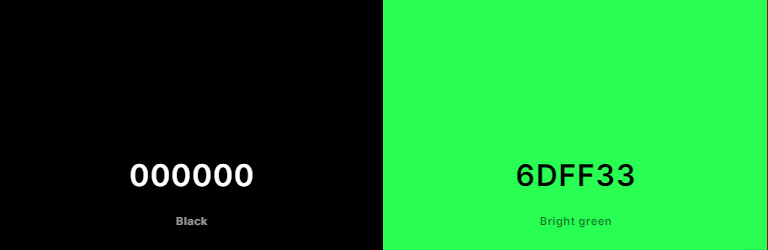
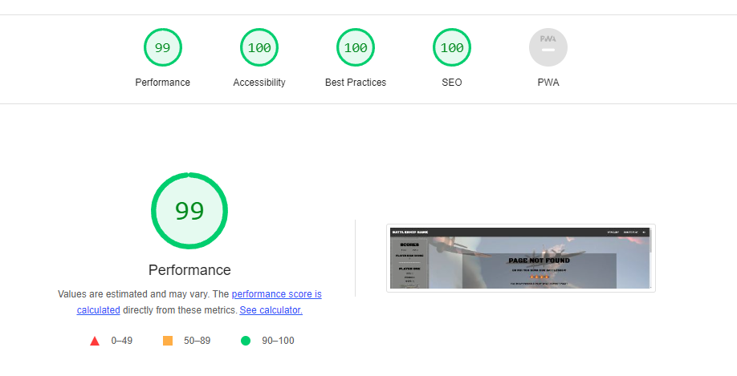

# BattleShip Game

(Developer: Matthew Shepherd)

[Live webpage](https://mat-shepherd.github.io/CI_PP2_BATTLESHIP_GAME/)

This project is a JavaScript-based Battleship game based on the classic baord game of Battleship. This is a responsive two-page game site which aims to provide casual online gamers with a simple, fun, and and interactive gaming experienc.

## Table of Contents

- [BattleShip Game](#battleship-game)
  - [Table of Contents](#table-of-contents)
  - [Project Goals](#project-goals)
    - [Site Owner Goals](#site-owner-goals)
    - [User Goals](#user-goals)
  - [User Experience](#user-experience)
    - [Target Audience](#target-audience)
    - [User Requirements and Expectations](#user-requirements-and-expectations)
    - [User Stories](#user-stories)
      - [Players](#players)
  - [Design](#design)
    - [Design Choices](#design-choices)
    - [Colours](#colours)
    - [Fonts](#fonts)
    - [Structure](#structure)
    - [Wireframes](#wireframes)
    - [Index](#index)
    - [404](#404)
  - [Technologies Used](#technologies-used)
    - [Languages](#languages)
    - [Frameworks \& Tools](#frameworks--tools)
  - [Features](#features)
    - [Existing Features](#existing-features)
    - [Logo and Navigation Bar](#logo-and-navigation-bar)
      - [Desktop \& Larger Screens](#desktop--larger-screens)
      - [Tablet, Mobile and Smaller Screens](#tablet-mobile-and-smaller-screens)
    - [Footer](#footer)
    - [Feedback Page](#feedback-page)
    - [404 Page](#404-page)
    - [Features Left to Implement](#features-left-to-implement)
  - [Testing](#testing)
    - [HTML Validation](#html-validation)
    - [CSS Validation](#css-validation)
    - [JavaScript Validation](#javascript-validation)
    - [Accessibility](#accessibility)
    - [Performance](#performance)
    - [Index](#index-1)
    - [Feedback Page](#feedback-page-1)
    - [404](#404-1)
    - [Device testing](#device-testing)
    - [Browser compatibility](#browser-compatibility)
    - [Testing user stories](#testing-user-stories)
      - [Prospective Customers](#prospective-customers)
      - [Existing Customers](#existing-customers)
      - [Site Owner](#site-owner)
  - [Bugs](#bugs)
  - [Deployment](#deployment)
  - [Credits](#credits)
    - [Media](#media)
    - [Wireframes](#wireframes-1)
    - [Index Page, Thank You Page \& 404 Page](#index-page-thank-you-page--404-page)
    - [404 Page](#404-page-1)
    - [Code](#code)
  - [Acknowledgements](#acknowledgements)

## Project Goals

The goals of this website include:

### Site Owner Goals

- Create a fun interactive game that furthers my understanding of problem solving through code and the JavaScript language
- Create an attractive and easy to use website and user interface
- Create a fully responsive game website

### Site Owner Goals

- Play a fun and interactive online game of logic and luck against a virtual opponent
- Quickly understand the rules of the game and how to play
- Be able to keep track of the game score and to try to beat their previous high score
- Play the game as often as desired and have the game remember their name and details

[Back to Table of Contents](#table-of-contents)

## User Experience

### Target Audience

- Battleship is typically played by anyone age 7 and up, that can follow the rules of Battleship, that likes to play online games, and has a JavaScript enabled web browser on their device.

### User Requirements and Expectations

- An intuitive navigation system regardless of screen size
- Easy to locate and understand game rules and instructions on how to play the game
- An intuitive game interface with clear controls and notifications to aid game play
- The ability to turn game sound effects on or off
- An easy way to provide the developer with feedback on the game
- An easy mechanism to start a new game and maintain session scores
- An accessibile game website that can be viewed and played on any device

### User Stories

The players of the game are the primary users of this website:

#### Players

1. As a player, I want to play an accessible, easy to understand, fun, and visually attractive game that is responsive on any device.
2. As a player, I want to see a list of game rules and instructions so I can understand how to play the game
3. As a player, I want to enter my name so I can understand which player represents me on the game board and to keep track of my current score and high score
4. As a player, I want my name to be validated and to be provided with feedback on any errors with name entry to ensure I can understand which player I am in the game.
5. As a player, I want to start a new game and receive directions on how to setup the game board
6. As a player, while setting up the game board, I want the ability to place and rotate my game pieces vertically or horizontally within the limits of the game board
7. As a player, I want any controls or buttons to be colourful, apparent, and attractive.
8. As a player, while setting up the game board, I want the ability to reset the game board to remove the game pieces (ships) and start placement over again
9. As a player, once the game board is set up I want to see notifications and visual cues to understand the game has started and which player's turn it is to take a shot
10. As a player, I want to see notifications and visual cues to understand how to take a shot, where my shot is going to be placed, and confirmation that my shot was registered
11. As a player, once a turn has been taken, I want to see notifications and visual cues to understand whose turn was taken and if the turn resulted in hitting or missing a ship
12. As a player, I want to see notifications and visual cues at all times during the game to keep track of how many hits, how many misses, and how many ships remain for each player
13. As a player, I want to see notifications and visual cues indicating when all of a player's ships have been sunk and which player has won the game
14. As a player, when a game has ended, I want to be given the option to start a new game
15. As a player, when a game has ended, I want my high score to be retained until I end my browser session

[Back to Table of Contents](#table-of-contents)

## Design

### Design Choices

The aim of this site is to provide the look and feel of the classic Battleship board game with its naval theme, while also conveying a Retro arcade game feel. All images, colours, and sounds were chosen with this aim in mind.

### Colours

The colour scheme for the game was based around classic Battleship and Naval themed colours mixed with a Retro arcade feel:

#### USER INTERFACE

Primary Colours - Grey / Light Grey

Secondary Colours - Red / Green / Blue

 

#### PLAYER MESSAGES

The player message text used a supplementary colour scheme of green on black to compliment the Retro Arcade theme.
 

To remain WCAG AAA compliant, I chose dark colour variants for background colours behind white, black, or bright green text to maintain maximum contrast. Colour contrast compliance was tested using [WebAIM's Contrast Checker tool](https://webaim.org/resources/contrastchecker/).

### Fonts

Black Ops One, Press Start 2P, and Roboto fonts were selected from Google fonts to match the naval and arcade themes of the game while maintaining readability and accessibility.

Black Ops One font is used for the site logo and primary headings. Roboto font used is as the main body text including the navigation, sidebar score text, and footer.

Black Ops One fallback fonts are Lucida Sans Typewriter, Helvetica, and sans-serif.

The Roboto and Press Start 2P fallback fonts are Arial, Helvetica, and sans-serif.

Fonts are imported using the Google Fonts library.

### Structure

The pages are structured in an easy-to-navigate z-shaped pattern allowing visitors to quickly consume key information while scanning the page from left to right. Starting at the top left of the page the visitor will notice the game logo followed by the navigation menu including New Game and How to Play links and an audio toggle icon. This allows the user to quickly understand the name of the game, how to start a new game, how to play, and how to toggle audio on or off.

For simplicity, the site consists of one primary page and two helper pages, a feedback page and a 404 page. There are seven distinct sections used across the site's pages:

#### INDEX PAGE, FEEDBACK PAGE, 404 PAGE

- A header navigation bar containing the game logo followed by the navigation menu including New Game and How to Play links, and an audio toggle icon
  
- A score sidebar (which moves to the footer area on smaller screens) which contains the scores and schips remaining for both players.

- A start game screen, that covers the main game body area, and contains a form to collect the player's name, a start game button and an audio toggle button.
  
- The main game body area which contains the player message container, the player and computer game boards, and the ship placmement controls (whic are hidden once the player has palced thier ships)

- A How to Play modal which conveys the rules of the game and how to play
  
- A win game screen, which is shown when all ships have been sunk, communicating whether the player has won or lost and providing an option to start a new game

- A footer section which displays the business logo, business tagline, navigation menu, call to action button, navigation links, contact information, social media links, the site owner's name and copyright notice, and a link to the site owner's GitHub page.

#### FEEDBACK PAGE

- A feedback screen, that covers the main game body area, and contains a form to collect player feedback, validate form values, show a thank you message on submission, and email the form data to the site owner.

#### 404 PAGE

- A 404 page not found message screen, that covers the main game body area, to let the user know they have entered an incorrect URL and provide them with a New Game button to navigate back to the game index page.

### Wireframes

### Index

iPhone SE

iPad Mini

Desktop

### 404

iPhone SE

iPad Mini

Desktop

[Back to Table of Contents](#table-of-contents)

## Technologies Used

### Languages

- HTML
- CSS
- JavaScript

### Frameworks & Tools

- [Git](https://git-scm.com/)
- [GitHub](https://github.com/)
- [Windows Visual Studio Code](https://www.gitpod.io/)
- [CodeAnywhere - Cloud IDE](https://codeanywhere.com/)
- [GIMP - image editor](https://www.gimp.org/)
- [Figma - wireframing tool](https://www.figma.com/files/recent?fuid=1219987136949485526)
- [Google Fonts](https://fonts.google.com/)
- [Font Awesome](https://fontawesome.com/)
- [ChatGPT by OpenAI - for code validation & suggestions](https://chat.openai.com/)
- [Favicon.io - Favicon generator](https://favicon.io/)
- [Coolors.co - Colour Palette Display Tool](https://coolors.co/)
- [JSHint JavaScript Validation Tool](https://jshint.com/)
- [W3C Markup Validation Service](https://validator.w3.org/)
- [W3C CSS Validation Service](https://jigsaw.w3.org/css-validator/)
- [WAVE web accessibility evaluation tool](https://wave.webaim.org/)
- [Google Lighthouse](https://developer.chrome.com/docs/lighthouse/overview/)

[Back to Table of Contents](#table-of-contents)

## Features

The website consists of three pages in total, an index page, afeedback page, and a 404 page. The site's pages contain ... distinct features:

### Existing Features

### Logo and Navigation Bar

- featured on all pages
- containing the game logo, a responsive navigation menu and a audio toggle button
- User stories covered:

#### Desktop & Larger Screens

#### Tablet, Mobile and Smaller Screens

### Footer

- which...
- User stories covered:

### Feedback Page

- which displays a feedback form to collect player feedback
- the feedback form validates form values and then sends the data to the site owner
- when the form is submitted a thank you message is shown
- User stories covered:

### 404 Page

- which displays a 404 page not found message, a ship image, and a text directing the user to click on a "New Game" button to navigate back to the index page.
- the header and footer navigation remains consistent with the index page design and all internal navigation links on this page will direct the user back to the index page.
- User stories covered:

### Features Left to Implement

The following features could be implemented in the future to provide users with more detailed information and further build prospective client trust through the website:

- I purposefully didn't hyperlink the logo to the index page to avoid a user clicking on it and losing their game progress. A click listener could be added to the logo and function added to warn the user before abandoning a game in progress.
- A 'smarter' computer opponenent could be implemented which would take random shots within a close range of a previous hit shout if that shot didn't result in sinking a ship. Currently the computer takes completely random shots within the bounds of the game grid, avoiding coordiantes that ahve a lready been shot on.
- With the ability to make the computer opponent 'smarter', a game difficulty feature could be added to let the user choose how difficult they want the game to be.
- I added an attribute for direction to ship objects with the intention of adding a flying plane animation when shots are taken. Knowing if a ship is vertical or horizontal and it's coordinates would allow a plane image to be animated horizontally or vertically across the board to match the ships rotation. Otherwise the plane would randomlyfly horizontally or vertically across the board if the shot was a miss.

[Back to Table of Contents](#table-of-contents)

## Testing

### HTML Validation

The W3C Markup Validation Service was used to validate the HTML of the website. All pages pass with no errors and no warnings shown.

- index.html [results](https://validator.w3.org/nu/?doc=https%3A%2F%2Fmat-shepherd.github.io%2FCI_PP2_BATTLESHIP_GAME%2F)
- feedback.html [results]()
- 404.html results [results](https://validator.w3.org/nu/?doc=https%3A%2F%2Fmat-shepherd.github.io%2FCI_PP2_BATTLESHIP_GAME%2F404.html)

### CSS Validation

The W3C Jigsaw CSS Validation Service was used to validate the CSS of the website.

- styles.css [results](https://jigsaw.w3.org/css-validator/validator?uri=https%3A%2F%2Fmat-shepherd.github.io%2FCI_PP2_BATTLESHIP_GAME%2Fassets%2Fcss%2Fstyle.css&profile=css3svg&usermedium=all&warning=1&vextwarning=&lang=en)

### JavaScript Validation

The JS Hint JavaScript Validation Service was used to validate the JavaScript code on the website. The results below show three code warnings related to "Functions declared within loops referencing an outer scoped variable may lead to confusing semantics". This was related to code I used to store and retrie click handlers and proved to be a difficult issue to overcome. I'm flaggining hhis for future improvement:

**Metrics**
There are 66 functions in this file.
Function with the largest signature take 8 arguments, while the median is 1.
Largest function has 53 statements in it, while the median is 6.
The most complex function has a cyclomatic complexity value of 25 while the median is 2.

**Three warnings**

- 1032	Functions declared within loops referencing an outer scoped variable may lead to confusing semantics. (currentShip, players, playerShips, computerShips, gameBoards, currentPlayer)
- 1071	Functions declared within loops referencing an outer scoped variable may lead to confusing semantics. (players, playerShips, computerShips, gameBoards, currentPlayer, currentShip)
- 1567	Functions declared within loops referencing an outer scoped variable may lead to confusing semantics. (currentShip, players, playerShips, computerShips, gameBoards, currentPlayer, randomShip, clearShips)

### Accessibility

The WAVE WebAIM web accessibility evaluation tool was used to ensure the website met high accessibility standards. All pages pass with 0 errors.

- index.html [results](https://wave.webaim.org/report#/https://mat-shepherd.github.io/CI_PP2_BATTLESHIP_GAME/index.html)
- feedback.html [results]()
- 404.html results [results](https://wave.webaim.org/report#/https://mat-shepherd.github.io/CI_PP2_BATTLESHIP_GAME/404.html)

### Performance

Google Lighthouse in Google's Chrome Developer Tools was used to test the performance of the website. All elements performed well.

### Index

Mobile

Desktop

### Feedback Page

Mobile

Desktop

### 404

Mobile

Desktop

### Device testing

The website was tested on the following devices:

- Windows 10 Pro Desktop PC
- Windows 10 Pro Microsoft Surface Book 2
- Samsung Galaxy S10

In addition, the website was tested using Google Chrome Developer Tools simulating all available device options.

### Browser compatibility

The website was tested on the following browsers:

- Google Chrome Version 112.0.5615.138 (Official Build) (64-bit)
- Mozilla Firefox Version 112.0.1 (64-bit)
- Microsoft Edge Version 112.0.1722.48

### Testing user stories

#### Prospective Customers

1. As a prospective customer, I want to see a list of the services offered by the consultant so that I can understand if the consultant can provide the solution my business is seeking.

| **Feature** | **Action** | **Expected Result** | **Actual Result** |
|-------------|------------|---------------------|-------------------|
| Services Section Services Cards| Click Services and/or Scroll to the Services Section | Locate three services and click a Request Pricing button | Works as expected |
| Contact Section Contact Form | Click Request pricing on Sevice Card, CTA buttons on the page, or scroll to the contact section at bottom of the page | Locate the contact form and send a message to ask about services provided | Works as expected |

Find Services Section and Contact

 

2. As a prospective customer, I want to see a description of each service so I can understand the services provided.

| **Feature** | **Action** | **Expected Result** | **Actual Result** |
|-------------|------------|---------------------|-------------------|
| Services Section Services Cards | Click Services and/or Scroll to the Services Section | Locate three services and click a Request Pricing button | Works as expected |
| Contact Section Contact Form | Click Request pricing on Sevice Card, CTA buttons on the page, or scroll to the contact section at bottom of the page | Locate the contact form and send a message to ask about services provided | Works as expected |

Find Service Descriptions and Contact

 

3. As a prospective customer, I want to see details of the consultant's customers so I can feel confident that the consultant can deliver results for a business like mine.

| **Feature** | **Action** | **Expected Result** | **Actual Result** |
|-------------|------------|---------------------|-------------------|
| Client Logos Section | Visible on page load even on most small screens otherwise can scroll to view | Client logos listed on page load | Works as expected |
| Client Testimonials Section| Click Testimonials and/or Scroll to the Client Testimonials section| Scroll to the Client Testimonials section to see one client testimonial | Works as expected |

Find Details of Consultant's Customers

 

4. As a prospective customer, I want to see details of the consultant's work experience and expertise to understand if they have the expertise required to handle my project.

| **Feature** | **Action** | **Expected Result** | **Actual Result** |
|-------------|------------|---------------------|-------------------|
| Hero Section | Read the hero section details to understand what the consultant provides | Read the hero section and click Ask Me How | Works as expected |
| Client Logos | Review client logos to understand the kinds of clients the consultant works with | Review client logos | Works as expected |
| About Matthew Section | Click About in the navigation menu or scroll to the About section | Scroll to the About Matthew section and read the details | Works as expected |

Find Details of the Consultant's Work Experience and Expertise

 

5. As a prospective customer, I want to submit questions or details of my project through the website so I can connect with the consultant to discuss my project and receive answers, set up, a call or receive a project proposal.

| **Feature** | **Action** | **Expected Result** | **Actual Result** |
|-------------|------------|---------------------|-------------------|
| Contact Form | Click Contact or Get a Quote in the navigation menu, Ask Me How in Hero Section, or Requesting Pricing in the Service section | Scroll to the contact form and submit a message | Works as expected |
| Contact Section | Click Contact to scroll to the contact form. If further contact information is required, click the link beneath the form submit button to scroll to the contact information in the footer | Scroll to the contact form and submit a message or use the email link in the footer | Works as expected |

Submit Message Through Contact Form

 

6. As a prospective customer, I want to locate the consultant's contact details so I can see where they are located and phone or email them about my project and any questions I may have.

| **Feature** | **Action** | **Expected Result** | **Actual Result** |
|-------------|------------|---------------------|-------------------|
| Google Map Contact Section | Click Contact to scroll to the Contact section or scroll down the page | Scroll to the Contact section and view the address and location on Google Map | Works as expected |
| Contact Section | Click Contact to scroll to the contact form. If further contact information is required, click the link beneath the form submit button to scroll to the contact information in the footer | Scroll to contact form and submit a message or use the email link or phone number in the footer | Works as expected |

Find Consultant's Contact Details and Location

 

7. As a prospective customer, I want to see a confirmation that my contact form has been submitted and be able to navigate back to the main site.

| **Feature** | **Action** | **Expected Result** | **Actual Result** |
|-------------|------------|---------------------|-------------------|
| Contact Form | Click Contact or Get a Quote in the navigation menu, Ask Me How in Hero Section, or Requesting Pricing in the Service section | Scroll to the contact form and submit a message | Works as expected |
| Thank You Page | Submit a contact form, thank you page loads | Read the Thank You page to see confirmation of details submitted | Works as expected |
| Thank You Page Navigation Links | Submit a contact form, thank you page loads, and then find a way to navigate back to the home page | Read the Thank You page to see confirmation of details submitted and then click on the Return Home link or any other internal link on the page to return to the index page | Works as expected |

Thank You Page

 

8. As a prospective customer, I want to locate the consultant's social media details so I can see if they are thought leaders in the space, learn from their content and see what other social media users say about them.

| **Feature** | **Action** | **Expected Result** | **Actual Result** |
|-------------|------------|---------------------|-------------------|
| Footer Contact Information Section | Click Contact to scroll to the Contact section. If within view, scroll to the social links in the footer (which is a typical location to find them), if not click the link beneath the form submit button to scroll to contact information in the footer | Scroll to contact information in the footer and locate the social media links and navigate to a social profile | Works as expected |

Find Consultant's Social Media Details

 

#### Existing Customers

9. As an existing customer, I want to locate the consultant's contact details or reach out to them directly through the website so I can request assistance or enquire about additional services.

| **Feature** | **Action** | **Expected Result** | **Actual Result** |
|-------------|------------|---------------------|-------------------|
| Contact Form | Click Contact or Get a Quote in the navigation menu, Ask Me How in Hero Section, or Request Pricing in the Service section. | Scroll to the contact form and submit a message | Works as expected |
| Contact Section | Click Contact to scroll to the contact form. If further contact information is required, click the link beneath the form submit button to scroll to the contact information in the footer | Scroll to the contact form and submit a message or use the email link in the footer | Works as expected |

Submit Message Through Contact Form

 

10. As an existing customer, I want to see a confirmation that my contact form has been submitted and be able to navigate back to the main site.

| **Feature** | **Action** | **Expected Result** | **Actual Result** |
|-------------|------------|---------------------|-------------------|
| Contact Form | Click Contact or Get a Quote in the navigation menu, Ask Me How in Hero Section, or Requesting Pricing in the Service section | Scroll to the contact form and submit a message | Works as expected |
| Thank You Page | Submit a contact form, thank you page loads | Read the Thank You page to see confirmation of details submitted | Works as expected |
| Thank You Page Navigation Links | Submit a contact form, thank you page loads, and then find a way to navigate back to the home page | Read the Thank You page to see confirmation of details submitted and then click on the Return Home link or any other internal link on the page to return to the index page | Works as expected |

Thank You Page

 

11. As an existing customer, I want to locate the consultant's social media details so I can follow them and learn about SEO industry trends and tips and tricks to improve my site's performance.

| **Feature** | **Action** | **Expected Result** | **Actual Result** |
|-------------|------------|---------------------|-------------------|
| Footer Contact Information Section | Click Contact to scroll to the Contact section. If within view, scroll to the social links in the footer (which is a typical location to find them), if not click the link beneath the form submit button to scroll to the contact information in the footer | Scroll to the contact information in the footer and locate the social media links and navigate to a social profile | Works as expected |

Find Consultant's Social Media Details

 

#### Site Owner

12. As a site owner, I want users to be able to see a list of my services and quickly contact me to request pricing.

| **Feature** | **Action** | **Expected Result** | **Actual Result** |
|-------------|------------|---------------------|-------------------|
| Services Section Services Cards | Click Services and/or Scroll to the Services Section | Locate three services and click the Request Pricing button | Works as expected |
| Contact Section Contact Form | Click Request pricing on Sevice Card, CTA buttons on the page, or scroll to the Contact section at the bottom of the page | Locate the contact form and send a message to ask about services provided | Works as expected |

Find Service Descriptions and Contact

 

13. As a site owner, I want users to see a list of my most recent clients and client testimonials to build trust and help convert more prospective customers.

| **Feature** | **Action** | **Expected Result** | **Actual Result** |
|-------------|------------|---------------------|-------------------|
| Client Logos Section | Visible on page load even on most small screens, otherwise the user will scroll down the page to view | Client logos listed on page load | Works as expected |
| Client Testimonials Section| Click Testimonials and/or scroll to the Client Testimonials Section| Scroll to the Client Testimonials section to see one client testimonial | Works as expected |

Find Details of Consultant's Customers

 

14. As a site owner, I want users to be able to contact me directly through the website.

| **Feature** | **Action** | **Expected Result** | **Actual Result** |
|-------------|------------|---------------------|-------------------|
| Contact Form | Click Contact or Get a Quote in the navigation menu, Ask Me How in the Hero Section, or Requesting Pricing in the Service section. | Scroll to the contact form and submit a message | Works as expected |
| Contact Section | Click Contact to scroll to the contact form. If further contact information is required, click the link beneath the form submit button to scroll to the contact information in the footer | Scroll to the contact form and submit a message or use the email link in the footer | Works as expected |

Submit Message Through Contact Form

 

15. As the site owner, I want to make sure users are directed back to the index page of the website and do not use their browser's back button should they come across a 404 page not found error.

| **Feature** | **Action** | **Expected Result** | **Actual Result** |
|-------------|------------|---------------------|-------------------|
| 404 Page | Navigate to a URL that doesn't exist within the sites file structure | Serve a 404 page telling the user the page doesn't exist and present options to navigate back to the index page | Works as expected |
| 404 Page Navigation Links | Navigate to a URL that doesn't exist within the sites file structure and find a way to navigate back to the home page | Read the 404 page and click on the Return Home link or any other internal link on the page to return to the index page | Works as expected |

404 Page

 

[Back to Table of Contents](#table-of-contents)

## Bugs

| **Bug** | **Fix** |
| ----------- | ----------- |
| The mobile hamburger menu icon had a small tap target and was difficult to select to open the menu. | The height of the menu button div was set to 100% which was leading to a height of 0px. Setting this to a fixed height of 30px corrected the issue. |
| The original code for the Mobile hamburger menu included a div inside of a label element, which was failing accessibility testing. | I changed the div to a span which passed accessibility tests with no impact on menu functionality. |
| Service containers were different heights which were determined by the amount of content they contained and the width of their parent elements as they flexed across different viewport sizes. | This was corrected by setting the align-self property to stretch for the service-containers class. Credit to the [Same Columns Height](https://flexbox.ninja/demos/same-height-columns/) article by [Geoffrey Crofte at Flexbox Ninja](https://flexbox.ninja/about/) and the [CSS equal height columns](https://daily-dev-tips.com/posts/css-equal-height-columns/) article by [Chris Bongers at Daily Dev Tips](https://daily-dev-tips.com/about/). |
| The mobile hamburger menu which is driven by pure HTML and CSS uses a checkbox and label element. The label element was empty which was producing an "A form label is present, but does not contain any content" error in the WAVE accessibility test. | This was corrected by adding text inside of a span element within the label element and then using a visually-hidden class and CSS to hide the text from rendering in the browser. Credit to [this Stack Overflow answer](https://stackoverflow.com/a/71369523/21643967) by [GrahamTheDev](https://stackoverflow.com/users/2702894/grahamthedev). |
| The parallax sections caused an accessibility warning as they didn't contain a heading tag. | The parallax sections were switch to div instead of section elements. |
| Google Lighthouse flags that several images are not using explicit width and height values which is causing Cumulative Layout Shift which is leading to a slightly reduced performance score. | As I chose to use img srcset to serve different image sizes across various screen size breakpoints along with image lazy loading to improve performance and user experience it wasn't practical to set explicit img widths and heights. A performance score of 98 is a good result and will provide mobile users with a great user experience even on slow mobile connections. Potential workarounds to consider for the future are in [this article](https://dev.to/grahamthedev/quick-tips-how-to-fix-image-elements-do-not-have-explicit-width-and-height-in-page-speed-insights-lighthouse-3776) by [GrahamTheDev](https://stackoverflow.com/users/2702894/grahamthedev) and [this article](https://jakearchibald.com/2022/img-aspect-ratio/) by Jake Archibald(<https://jakearchibald.com/>). |

[Back to Table of Contents](#table-of-contents)

## Deployment

The website was deployed using GitHub Pages by following these steps:

1. In the GitHub repository navigate to the Settings tab
2. On the left-hand menu select Pages
3. For the source select Branch: master
4. After the webpage refreshes automatically you will see a ribbon on the top saying: Your site is live at <https://mat-shepherd.github.io/ci-pp1-nurture-seo/>

You can for fork the repository by following these steps:

1. Go to the GitHub repository
2. Click on Fork button in the upper right-hand corner

You can clone the repository by following these steps:

1. Go to the GitHub repository
2. Locate the Code button above the list of files and click it
3. Select if you prefer to clone using HTTPS, SSH, or Github CLI and click the copy button to copy the URL to your clipboard
4. Open Git Bash
5. Change the current working directory to the one where you want the cloned directory
6. Type git clone and paste the URL from the clipboard ($ git clone <https://github.com/YOUR-USERNAME/YOUR-REPOSITORY>)
7. Press Enter to create your local clone.

[Back to Table of Contents](#table-of-contents)

## Credits

Images and logos not referenced below are owned or created by the developer.

### Media

In order of appearance:

### Wireframes

- [Figma Wireframing Kit](https://www.figma.com/community/file/1088059168988686975) by [Tiago Gonçalves](https://www.figma.com/community/file/1088059168988686975)
    

Image Placeholders

    
    

- [Website Wireframes UI Kit](https://www.figma.com/community/file/1212997233512196965) by [UI-UX Expert](https://www.figma.com/@uiux_expert)
    

Button, Menu and Form Elements

    
    

- [placehold.co](https://placehold.co/)
    

Placeholder Images

    
    

- [HubSpot Brand Kit Generator](https://www.hubspot.com/brand-kit-generator/) by [HubSpot](https://www.hubspot.com/)
    

Logo

    
    

- Font Awesome Icons by [Font Awesome](https://fontawesome.com/)
    

Service Section [Font Awesome Icons](https://fontawesome.com/icons)

    
    

- [Social icons](https://pixabay.com/vectors/social-media-icon-set-facebook-6261537/) by [goddessSue13](https://pixabay.com/users/goddesssue13-615343/)
    

Social icons

    
    

### Index Page, Thank You Page & 404 Page

- [HubSpot Brand Kit Generator](https://www.hubspot.com/brand-kit-generator/) by [HubSpot](https://www.hubspot.com/)
    

Logo

    
    

- Purchased under subscription from [iStock Photos](https://www.istockphoto.com/) by [Mykyta Dolmatov](https://www.istockphoto.com/portfolio/VectorKnight?mediatype=illustration)
    

Hero Image

    
    

- Roadtrips Logo used with permission of former client [Roadtrips](https://www.roadtrips.com/)
    

Client Logo: Roadtrips

    
    

- iQmetrix Logo used with permission of former client [iQmterix](https://www.iqmetrix.com/)
    

Client Logo: iQmetrix

    
    

- Scootaround Logo used with permission of former client [Scootaround](https://scootaround.com/en)
    

Client Logo: Scootaround

    
    

- IP Telecom Logo used with permission of former client [IP Telecom](https://www.iptelecom.ie/)
    

Client Logo: IP Telecom

    
    

- Purchased under subscription from [iStock Photos](https://www.istockphoto.com/) by [amenic181](https://www.istockphoto.com/portfolio/amenic181?mediatype=photography)
    

First Parallax Image: Young plant stock photo

    
    

- Font Awesome Icons by [Font Awesome](https://fontawesome.com/)
    

Service Section [Font Awesome Icons](https://fontawesome.com/icons)

    
    

- Purchased under subscription from [iStock Photos](https://www.istockphoto.com/) by [Photodjo](https://www.istockphoto.com/portfolio/Photodjo?mediatype=photography)
    

Second Parallax Image: Agriculture stock photo

    
    

- [goddessSue13](https://pixabay.com/users/goddesssue13-615343/)
    

[Social icons](https://pixabay.com/vectors/social-media-icon-set-facebook-6261537/)

    
    

### 404 Page

- Purchased under subscription from [iStock Photos](https://www.istockphoto.com/) by [ilyakalinin](https://www.istockphoto.com/portfolio/ilyakalinin?mediatype=illustration)
    

Missile crashed Page not found error 404

    
    
  

### Code

In order of appearance:

- The layout of the site was inspired by (but no code was copied from) [Workhu's website](https://workhu.com/)
- Font selections were inspired by the [21 Google Fonts Combinations For Websites & Brands](https://www.garett.co/21-google-fonts-combinations-for-websites-brands) article by [Garett Southerton](https://www.garett.co/about)
- The markdown structure of this readme and the deployment steps were based on the structure and content of the following readme.md files from other Code Institute student projects:
  - <https://github.com/4n4ru/CI_MS1_BodelschwingherHof>
  - <https://github.com/jamie2210/CI_MS1_TBC>
- The HTML and CSS code for the mobile hamburger menu was copied and modified from the [Pure CSS responsive menu](https://codepen.io/alvarotrigo/pen/MWEJEWG) example by [Álvaro](https://codepen.io/alvarotrigo)
- The accessibility bug where the label element used in the mobile menu required text was overcome using the code from [this Stack Overflow answer](https://stackoverflow.com/a/71369523/21643967) by [GrahamTheDev](https://stackoverflow.com/users/2702894/grahamthedev)
- Flexbox methods used throughout the site were learned from [W3C Schools](https://www.w3schools.com/css/css3_flexbox_container.asp) and the amazing [Complete Guide to Flexbox](https://css-tricks.com/snippets/css/a-guide-to-flexbox/) by [Chris Coyier at CSS Tricks](https://css-tricks.com/author/chriscoyier/)
- The method for providing alternate text for background images was adapted from the [Alternate text for background images](http://www.davidmacd.com/blog/alternate-text-for-css-background-images.html) by [David MacDonald](https://www.davidmacd.com/david_macdonald_bio.html)
- img srcset methods used to display different images at various breakpoints were learned from the [Responsive images with srcset and sizes](https://medium.com/@woutervanderzee/responsive-images-with-srcset-and-sizes-fc434845e948) by [Wouter van der Zee](Wouter van der Zee) and breakpoints were chosen with the help of the [Responsive Image Breakpoints Generator v2.0](https://www.responsivebreakpoints.com/) tool by [Cloudinary](https://cloudinary.com/)
- The flexbox method to achieve equal height columns for the index page's service containers was learned from the [Same Columns Height](https://flexbox.ninja/demos/same-height-columns/) article by [Geoffrey Crofte at Flexbox Ninja](https://flexbox.ninja/about/) and the [CSS equal height columns](https://daily-dev-tips.com/posts/css-equal-height-columns/) article by [Chris Bongers at Daily Dev Tips](https://daily-dev-tips.com/about/)
- CSS Gradients in the service containers of the index page were achieved using the code output from the CSS Gradient tool at [cssgradient.io](https://cssgradient.io/)
- The method to achieve a circular frame around the index page's headshot image was adapted from the [Code Institute's Love Running Project](https://github.com/Code-Institute-Org/love-running-2.0).
- CSS commenting styles were based on the [Principles of writing consistent, idiomatic CSS readme](https://github.com/necolas/idiomatic-css) by [Nicolas Gallagher](https://github.com/necolas)
- The JavaScript used to parse form values from URL parameters on the thank-you.html page was adapted from the code written by [Yaphi Berhanu and James Hibbard of SitePoint](
<https://www.sitepoint.com/get-url-parameters-with-javascript/>)
- The JavaScript function to output URL parameters from the above script was generated using [ChatGPT by OpenAI](https://openai.com/) and then adapted.

[Back to Table of Contents](#table-of-contents)

## Acknowledgements

I would like to thank the following people for their contributions to creating this project:

- My mentor Mo Shami for your support, guidance, and encouragement
- Alan Bushelland the February 2023 Student Cohort for their knowledge sharing, advice, and camaraderie during our weekly standup calls and in Slack
- Benjamin Riordan for reviewing my project and providing great constructive feedback
- The Code Institute team for an excellent experience and great support leading up to this first project
- My wife for her patience and support while I sit in front of the computer for hours on end
- My boys William and Oliver for helping me test the site and spot bugs!

[Back to Table of Contents](#table-of-contents)
